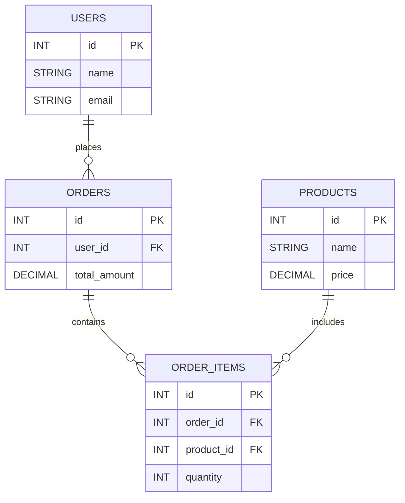

```mermaid
erDiagram
USERS {
    INT id PK
    STRING name
    STRING email
    }
ORDERS {
    INT id PK
    INT user_id FK
    DECIMAL total_amount
}
PRODUCTS {
    INT id PK
    STRING name
    DECIMAL price
}
ORDER_ITEMS {
    INT id PK
    INT order_id FK
    INT product_id FK
    INT quantity
}
USERS ||--o{ ORDERS : places
ORDERS ||--o{ ORDER_ITEMS : contains
PRODUCTS ||--o{ ORDER_ITEMS : includes
```
